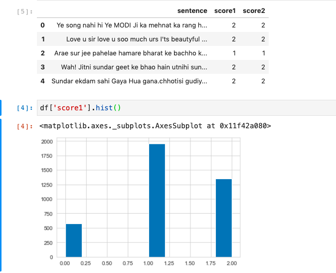
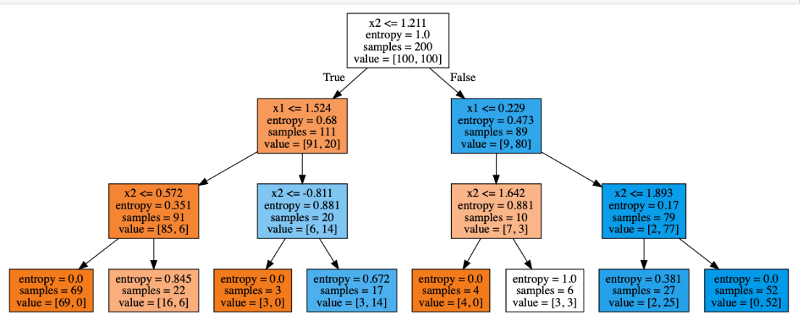
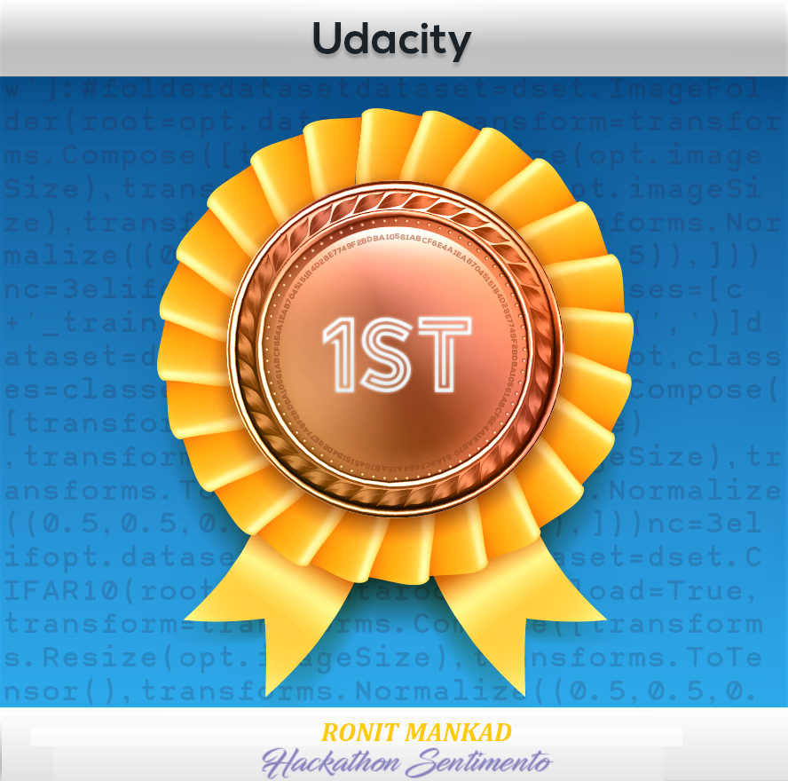
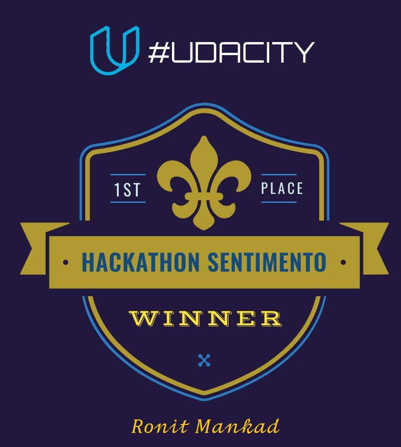

# Introduction

This repository tracks my day-to-day progress for the #60DaysOfUdacity challenge for the [Secure and Private AI scholarship](https://www.udacity.com/facebook-AI-scholarship) by Udacity and Facebook.

> All the code posted here will be slightly modified so that it doesn't violate Udacity's Honor Code of Conduct.

---

## Completed Projects List

| No  |  Project Title  |  Completed On |
| :------------: | ------------ | :------------: |
| 1 | Implementing Differential Privacy on the MNIST Dataset and performing PATE Analysis on the Model | Before the Challenge |
| 2 | Published an article on Medium for the above project. | Before the Challenge |
| 3 | Hackathon Blossom (Flower Classification) | Day 17 |
|4| Hackathon Auto_Matic (Car Classification) |Day 25|
|5| Hackathon Sentimento (Sentiment Classification) |Day 32|

---
## Timeline :point_down:
### Day 1 -  Thursday, 27th June

 - Took the **#60DaysOfUdacity** challenge pledge :fire:
 - Completed Lesson 9, Video 3: Encrypted Subtraction and Public Multiplication

---
### Day 2 - Friday, 28th June

- Completed Lesson 9, Video 4: Encrypted Computation in PySyft.
- Finished a project performing Federated Learning on MNIST using PySyft's FederatedDataLoader.
- Learned **matplotlib** - *bar charts*, *line charts* and *scatter plots*

---

### Day 3 - Saturday, 29th June

- Studied more about Encrypted Deep Learning by reading this post - [Encrypted Deep Learning Classification with PyTorch & PySyft](https://blog-openmined-org.cdn.ampproject.org/v/s/blog.openmined.org/encrypted-deep-learning-classification-with-pysyft/amp/?usqp=mq331AQA&amp_js_v=0.1#aoh=15618027595980&csi=1&referrer=https%3A%2F%2Fwww.google.com&amp_tf=From%20%251%24s&ampshare=https%3A%2F%2Fblog.openmined.org%2Fencrypted-deep-learning-classification-with-pysyft%2F)
- Learned **Descriptive Statistics** - *Dispersion*, *Correlation*

---
### Day 4 - Sunday, 30th June

- Completed Lesson 9, Video 6 - Encypted Deep Learning with Pytorch.
- Learned **Probability** - *Dependence and Independence*, *Conditional Probability*

---
### Day 5 - Monday, 1st July

- Completed Lesson 9, Video 7 - Encrypted Deep Learning with Keras
- Completed Lesson 9, Video 8 and 9 - Keystone Project Description and course conclusion.
- Learned **Probability** - *Bayes Theorem*, *Random Variables*, *Continuous Distributions*

- **Finally Completed the Course** 🦓 :fire:

---
### Day 6 - Tuesday, 2nd July

- Read this article [Federated Learning for Medical Imaging](https://www.intel.ai/federated-learning-for-medical-imaging/#gs.mayzfj).
- Learned *Statistical Hypothesis and Inference*

---
### Day 7 - Wednesday, 3rd July

- Read an article on CNNs - [The Most Intuitive and Easiest Guide for Convolutional Neural Network](https://towardsdatascience.com/the-most-intuitive-and-easiest-guide-for-convolutional-neural-network-3607be47480)
- Read PyTorch docs for the `torch.nn.Conv2d` and `torch.nn.MaxPool2d` layers.

---
### Day 8 - Thursday, 4th July

- Read more about *Statistical Hypothesis and Inference*
- Read up on **Gradient Descent** - *Stochastic Gradient Descent*

---
### Day 9 - Friday, 5th July

- Explored https://data.gov.in for public datasets.
- Read about PyTorch data cleaning and data transformation pipelines.
- Learned more about Gradient Descent.

---

### Day 10 - Saturday, 6th July

- Learning Backpropogation.

---
### Day 11 - Monday, 8th July
- **Missed a Day but now I'm back on track**
- Completed Backpropogation. Practiced a lot by differentiating equations by hand.
- Started learning how to scrape the web using _BeautifulSoup_.

---
### Day 12 - Tuesday, 9th July
- Started exploring the [CO2 emmissions from Fossil Fuels](https://datahub.io/core/co2-fossil-by-nation) dataset. Will understand the data for a few days then try forecasting, may even use encrypted deep learning to make things interesting.
- Started learning *Dimensionality Reduction*.

---

### Day 13 - Wednesday, 10th July
- Played with the CO2 emissions from Fossil Fuels dataset and gained a few insights. 
- Gained the intuition about the dataset by plotting various graphs.

    

---

### Day 14 - Thursday, 11th July
- Started the day of with this week's #sg_applied_dl group project: Dog [Breed Identification](https://www.kaggle.com/c/dog-breed-identification) competition on Kaggle. My Kaggle kernel: https://www.kaggle.com/ronitmankad/let-s-classify-dog-breeds/notebook
- Did some research on what ML models can I apply on the CO2 emissions dataset.
- Learned a lot about *Seaborn* and *Plotly* by doing these projects.

---

### Day 15 - Friday, 12th July
- Spent the day solving the #sg_applied_dl weekly hackathon project - [Dog Breed Identification](https://www.kaggle.com/c/dog-breed-identification) competition on Kaggle. My Kaggle kernel: https://www.kaggle.com/ronitmankad/let-s-classify-dog-breeds

- Created a custom dataset using by subclassing *torch.utils.dataset.Dataset* module and transformed the dataframe so that it could be fed into the classifier.

---
### Day 16 - Saturday, 13th July

- Started the #sg_hackathon-orgnizrs weekly hackathon: [Hackathon Blossom (Flower Classification)](https://www.kaggle.com/spaics/hackathon-blossom-flower-classification).

- Developed a processing pipeline for the dataset as well as explored its features through visualization.

---

### Day 17 - Sunday, 14th July

- Completed the #sg_hackathon-orgnizrs weekly hackathon: [Hackathon Blossom (Flower Classification)](https://www.kaggle.com/spaics/hackathon-blossom-flower-classification).
- Fine tuned the model and cleaned up the code so that it can be submitted for evaluation.
- Learned quite a lot about hyperparameter optimization and transfer learning while doing this hackathon.
- I would like to encourage all the paticipants: @Helena Barmer @Abhishek Lalwani @sourav kumar @Jess @Shahana @Vikas Sharma @Shanmugapriya @Ruchika Khemka @Naas Mohamed @Deepak @Shubhangi Jena @par @Droid @KT  @Francesca @Jaffar @Aniket Thomas @Vebby @Archit  @Halwai Aftab Hasan @Shivam Raisharma @Hitoishi Das @cibaca   @Shashank Jain @Nirupama Singh  @Perez Ogayo @shivu @Anita Goldpergel @Ivy
---

### Day 18 - Monday, 15th July

- Finally submitted my kernel for Hackathon Blossom. Thank you to all the organizers in #sg_hackathon-orgnizrs. My Kernel link: https://www.kaggle.com/ronitmankad/flower-classification-using-pytorch

- Started reading Hands On Machine Learning with ScikitLearn and Tensorflow.

---

### Day 19 - Tuesday, 16th July
- Started Chapter 3: Classification of the Hands on ML book.
- Learned about _precision_ and _recall_ and the ROC curve.
---
### Day 20 - Wednesday, 17th July
- Kept on reading Ch 3 Classification of the Hands-On-ML book.
- Learned about _Error Analysis_ in classification.
- Read about *Multilabel* and *Multioutput classification*.
---

### Day 21 - Thursday, 18th July
- Read about Sentiment Analysis in Coded Mixed Language (specifically Hindi-English) from [this](https://arxiv.org/abs/1804.00806) paper.
- Brushed up on text processing and NLP basics for an interview.
---

### Day 22 - Friday, 19th July
- Learned more about the mathematical notations in machine learning.
- Read up on Random Variables and Unbiased Estimators.
- Researched about sentence similarity prediction.
---

### Day 23 - Saturday, 20th July
- Started the #sg_hackathon-orgnizrs weekly Hackathon - Auto_Matic! 
- Explored the dataset and created a data processing pipeline.
- Will now create different models and try to increase the accuracy.
---
### Day 24 - Sunday, 21st July
- Testing different models on the dataset for the hackathon.
- Trying to improve the validation and testing accuracy.
- Will try more image augmentation techniques.
---

### Day 25 - Monday, 22nd July
- Completed #sg_hackathon-orgnizrs Hackathon Auto_Matic (even though my model's accuracy was very low).
- Kaggle Kernel Link: https://www.kaggle.com/ronitmankad/ronit-mankad-auto-matic
- Continued reading the 100 page ML book, read about Decision Tree classifiers.
---

### Day 26 - Tuesday, 23 July
- Continued reading the 100 Page ML book, learned more about Decision Trees and SVMs.
---

### Day 27 - Wednesday, 24th July
- Worked on the hackathon Auto_matic dataset and tried to learn from my mistakes.
- Completed the Decision Trees chapter and implemented Linear Regression, SVM and a Decision Tree in Python from scratch.
---

### Day 28 - Thursday, 25th July
- Tried to implement a SVM with different kernels from scratch but ran into some problems, will continue tomorrow.
- Started learning K Nearest Neighbors.
- Started learning the different implementations of sentiment analysis for the next #sg_hackathon-orgnizrs Hackathon.
---

### Day 29 - Friday, 26th July
- Read two papers on Sentiment Analysis on Code Mixed languages (for an interview I have).

- Explored and processed a text dataset containing Hindi-English mixed tweets.
- Developed an embedding matrix for the data using Glove Embeddings.

---

### Day 30 - Saturday, 27th July
- Worked on Sentiment Analysis in Code Mixed language.
- Developed a Sub-Word RNN.
- Also started Hackathon Sentimento! All the best to all the participants.
---

### Day 31 - Sunday, 28th July
- Worked on the Sentiment Classification Hackathon Sentimento. 
- Tried on different pre-processing techniques and different models on the dataset.

---

### Day 32 - Monday, 29th July
- Completed Hackathon Sentimento!
- Learned a lot about TFIDF and text preprocessing.
- Scored 0.89 on the leaderboard.
---

### Day 33 - Tuesday, 30th July 
- Read more about K Nearest Neighbours from the 100 Page ML book. 
- Also stareted reading about featuring engineering.
---

### Day 34 - Wednesday, 31st July 
- Completed the KNN chapter from the 100 Page ML book.
- Implemented Decision Tree and visualized it's nodes by follwing this tutorial - https://mlcourse.ai/articles/topic3-dt-knn/
- Read this Medium Article - https://towardsdatascience.com/how-to-farm-kaggle-in-the-right-way-b27f781b78da
---

### Day 35 - Thursday, 1st August 
- Read and implemented this excellent Jupyter Notebook - https://mlcourse.ai/articles/topic2-visual-data-analysis-in-python/
- Completed implementing the Decision Tree code.

- Started the IEEE-CIS Fraud Detection competition on Kaggle - https://www.kaggle.com/c/ieee-fraud-detection
---
 ### Day 36 - Friday, 2nd August
 - Learned about Ordinary Least Squares, Maximum Likelihood Estimation and Bias-Variance Decomposition from this excellent tutorial - https://mlcourse.ai/articles/topic4-part1-linreg/

 - Won the gold badge for Hackathon Sentimento! Thanks to all the good people at #sg_hackathon-orgnizrs
 
 

 - Created a new Kernel for my winning solution for Hackathon Sentimento - https://www.kaggle.com/ronitmankad/sentiment-analysis-eda-and-model-creation

- Started exploring the dataset for the IEEE-Fraud Detection competition on Kaggle.
---

### Day 37 - Saturday, 3rd August
- Started the #sg_hackathon-orgnizrs weekly hackathon - Hackathon Sentimento-2.
- Created a kaggle kernel and started working on the dataset.
---